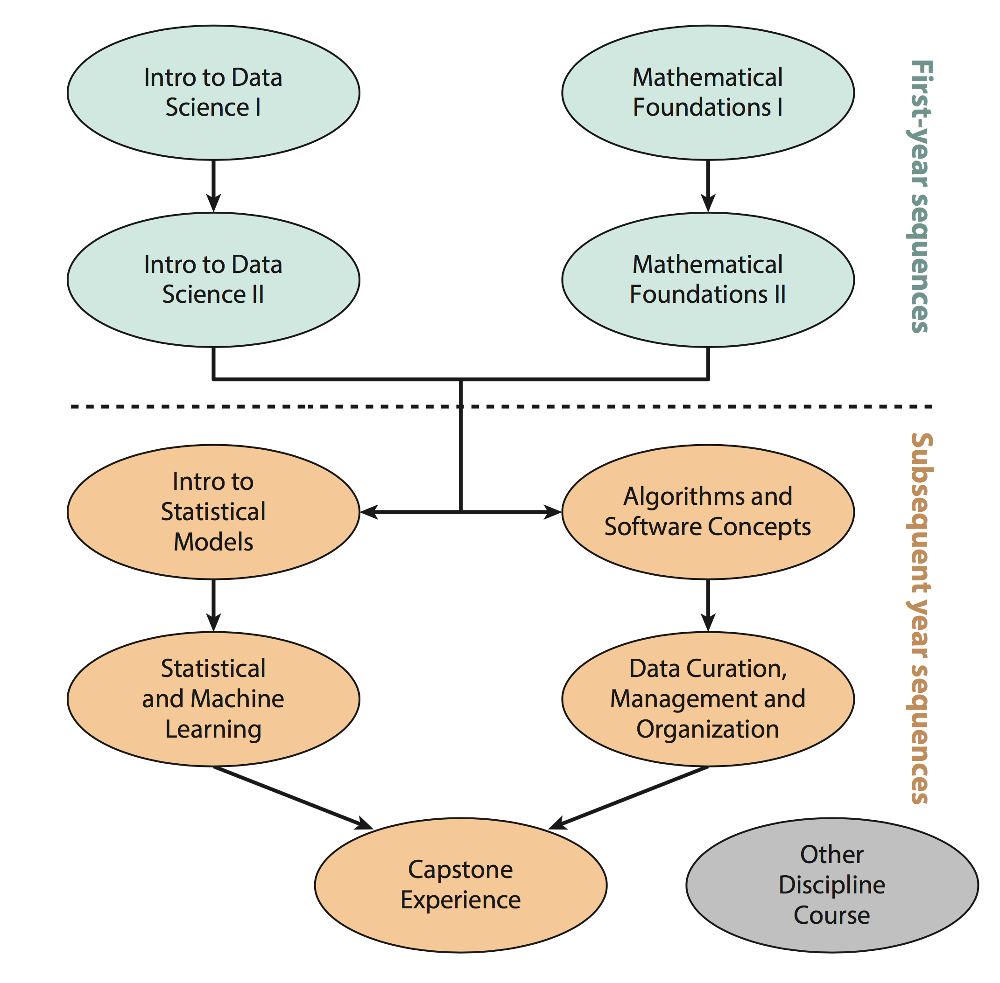
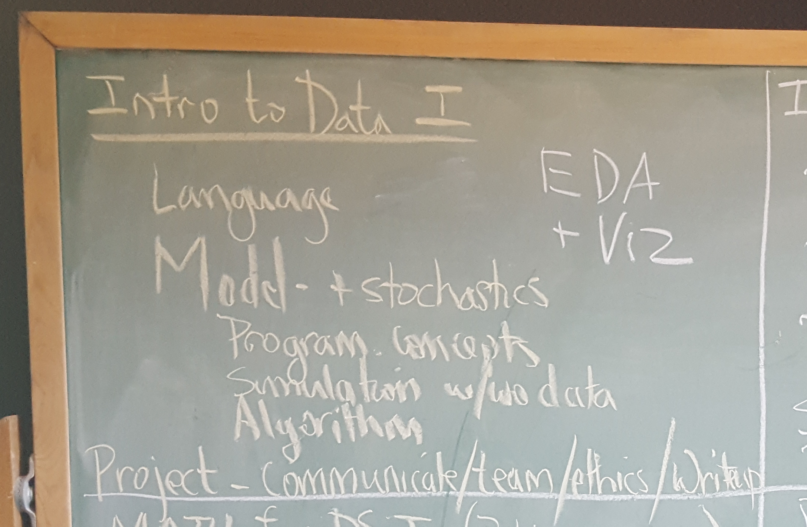
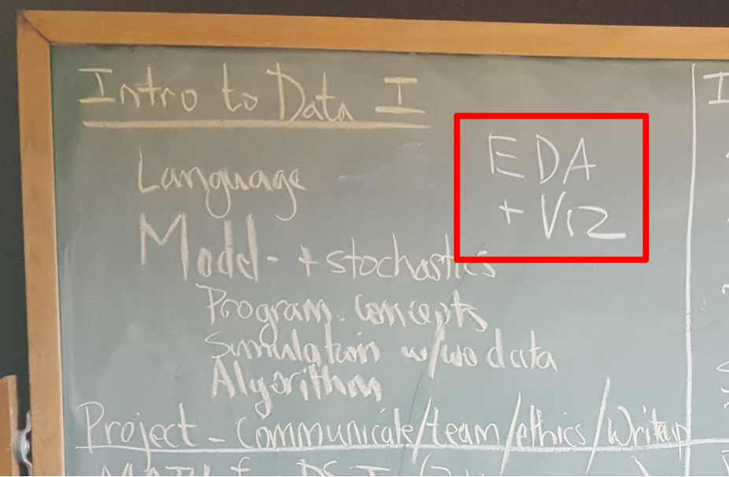

<style>
h2 { 
 color: #3399ff;		
}
h3 { 
 color: #3399ff;		
}
slides > slide.backdrop {
  background: white;
}
</style>


```{r setup, include=FALSE}
knitr::opts_chunk$set(echo = FALSE)
```


## PCMI 

> * Park City Math Institute (PCMI) Undergraduate Faculty Group Summer 2016
> * [Curriculum Guidelines for Undergraduate Programs in Data Science](https://www.amstat.org/asa/files/pdfs/EDU-DataScienceGuidelines.pdf)
> * Ben Baumer asked: *"What if we blew up math, stats, CS, and all their legacies and started over? What would this field look like?"*


## Flowchart

<center></center>


## Intro to Data Science I

<center></center>


## Intro to Data Science I

<center></center>


## Vision

> * A complete 'alpha to omega' intro to Data Science. 
> * Students will engage in the full data workflow, from the initial investigation and data acquisition to the communication of results
> * i.e. Grolemund/Wickham's full data/science pipeline <center></center>


## Learning Goals

> * Exploring and wrangling data
> * Writing basic functions and coding
> * Summarizing, visualizing, and analyzing data
> * Modeling and simulating deterministic and stochastic phenomena
> * Presenting the results of a complete project in written, oral, and graphical
forms